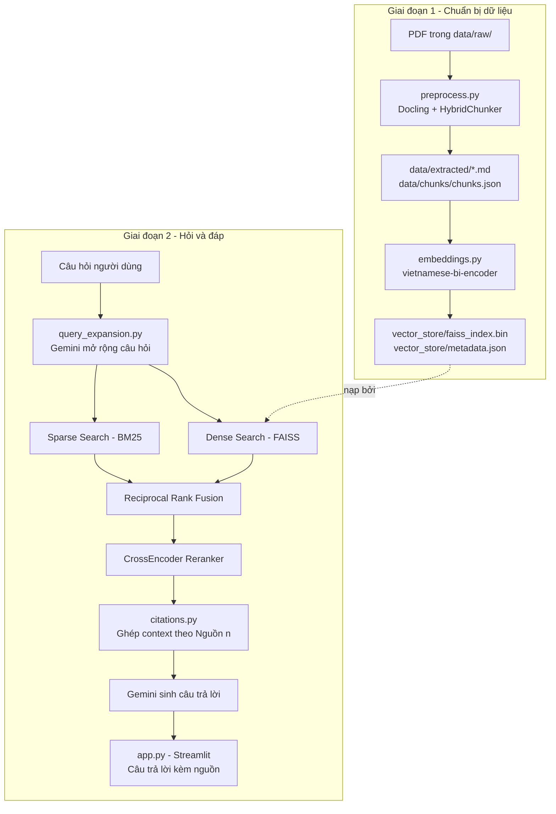

# Hệ thống hỏi–đáp Quy chế Đào tạo HUSC sử dụng RAG

Hệ thống hỏi–đáp giúp tra cứu **quy chế đào tạo đại học theo hệ thống tín chỉ** của Trường Đại học Khoa học, Đại học Huế (HUSC). Với mỗi câu hỏi, hệ thống truy xuất các đoạn quy chế liên quan, dùng Gemini để sinh câu trả lời ngắn gọn kèm trích dẫn nguồn theo tên tài liệu và số trang.

Dự án ở mức **prototype**, phục vụ đề tài:

> Xây dựng hệ thống hỏi–đáp hỗ trợ tra cứu quy chế đào tạo tiếng Việt sử dụng RAG có trích dẫn nguồn.

Tài liệu đang được nạp trong dự án:

- **Quyết định số 673/QĐ-ĐHKH** (22/09/2021) — Quy chế đào tạo đại học theo hệ thống tín chỉ của Trường Đại học Khoa học.
- **Quyết định số 1453/QĐ-ĐHKH** (19/12/2025) — Sửa đổi một số điều của Quy chế đào tạo ban hành theo Quyết định 673/QĐ-ĐHKH.

## Chức năng chính

- Đọc và phân tích PDF bằng Docling (giữ cấu trúc bảng biểu).
- Làm sạch văn bản, chia chunk bằng `HybridChunker` và trích metadata pháp lý: chương, mục, điều, khoản, điểm, số hiệu văn bản.
- Tạo embedding tiếng Việt bằng `bkai-foundation-models/vietnamese-bi-encoder`, lưu vào **FAISS** (`IndexFlatIP`).
- Mở rộng câu hỏi bằng Gemini để tăng khả năng tìm đúng khi người dùng hỏi khác cách diễn đạt trong tài liệu.
- Kết hợp Dense Search (FAISS) và BM25 bằng Reciprocal Rank Fusion (RRF), sau đó rerank bằng CrossEncoder.
- Sinh câu trả lời chỉ dựa trên nội dung truy xuất được, trích dẫn theo dạng `[Nguồn n]` kèm tên file và số trang.
- Giao diện hỏi–đáp trên Streamlit, có lưu lịch sử chat.
- Script đánh giá tự động (`evaluate.py`) chấm PASS/FAIL trên bộ câu hỏi mẫu và xuất báo cáo JSON.

## Kiến trúc hệ thống



## Cấu trúc thư mục

```text
Project-LLM-RAG/
├── data/
│   ├── raw/                    # PDF gốc
│   │   ├── 01_quy_che_dao_tao_husc_qd_673_2021.pdf
│   │   └── qd_1453_dhkh.pdf
│   ├── extracted/               # Markdown do Docling xuất ra (để xem nhanh)
│   └── chunks/
│       └── chunks.json          # Các chunk kèm metadata pháp lý
├── vector_store/
│   ├── faiss_index.bin           # FAISS IndexFlatIP
│   └── metadata.json              # Metadata tương ứng từng vector
├── src/
│   ├── preprocess.py       # Đọc PDF, làm sạch, chia chunk, trích metadata pháp lý
│   ├── embeddings.py       # Tạo embedding và build FAISS index
│   ├── query_expansion.py   # Mở rộng câu hỏi bằng Gemini
│   ├── retriever.py         # Dense (FAISS) + BM25 + RRF + CrossEncoder rerank
│   ├── citations.py         # Chuẩn hoá và định dạng trích dẫn nguồn
│   ├── rag_pipeline.py      # Kết nối retriever + Gemini để sinh câu trả lời
│   ├── app.py                # Giao diện Streamlit
│   └── evaluate.py           # Đánh giá tự động theo bộ câu hỏi mẫu
├── requirements.txt
└── README.md
```

## Công nghệ sử dụng

| Thành phần | Công nghệ |
| --- | --- |
| Ngôn ngữ | Python 3.11 |
| Đọc và phân tích PDF | Docling (`PyPdfiumDocumentBackend`, `TableFormerMode.ACCURATE` cho bảng) |
| Chia chunk | Docling `HybridChunker`, giới hạn 256 token theo tokenizer của mô hình embedding |
| Embedding | `bkai-foundation-models/vietnamese-bi-encoder` (768 chiều) |
| Vector store | FAISS `IndexFlatIP` (tương đương cosine similarity vì vector đã normalize) |
| Tìm kiếm từ khoá | BM25Okapi (`rank-bm25`) |
| Hợp nhất kết quả | Reciprocal Rank Fusion (RRF) |
| Reranker | `cross-encoder/mmarco-mMiniLMv2-L12-H384-v1` |
| Mở rộng truy vấn & sinh câu trả lời | Google Gemini, qua SDK `google-genai` |
| Giao diện | Streamlit |
| Cấu hình | `python-dotenv` |

## Yêu cầu môi trường

- Python 3.11 (khuyến nghị).
- Git.
- Gemini API key.
- Kết nối Internet trong lần chạy đầu để tải mô hình từ Hugging Face.

## Cài đặt

### 1. Tải dự án

```bash
git clone https://github.com/baothenotone/Project-LLM-RAG.git
cd Project-LLM-RAG
```

### 2. Tạo môi trường ảo

Trên Windows PowerShell:

```powershell
python -m venv .venv
.\.venv\Scripts\Activate.ps1
```

Trên Linux hoặc macOS:

```bash
python3 -m venv .venv
source .venv/bin/activate
```

### 3. Cài thư viện

```bash
python -m pip install --upgrade pip
python -m pip install -r requirements.txt
python -m pip install docling google-genai
```

> **Lưu ý:** `requirements.txt` hiện chưa khớp hoàn toàn với mã nguồn trong `src/`:
> - **Thiếu:** `docling` (dùng trong `preprocess.py`) và `google-genai` (dùng trong `query_expansion.py`, `rag_pipeline.py`) chưa được khai báo — cần cài thêm bằng lệnh ở trên. `transformers` cũng được `preprocess.py` import trực tiếp; gói này thường đã có sẵn vì là phụ thuộc của `sentence-transformers`, nhưng nên khai báo tường minh trong `requirements.txt` để tránh phụ thuộc ẩn.
> - **Thừa:** `pymupdf`, `pandas`, `tqdm`, `jupyter`, `ipykernel` được khai báo nhưng không còn được import ở bất kỳ file nào trong `src/` hiện tại — có vẻ là phần còn lại từ giai đoạn dùng PyMuPDF/notebook để đọc PDF trước khi chuyển sang Docling.

## Cấu hình biến môi trường

Tạo file `.env` tại thư mục gốc dự án:

```env
GEMINI_API_KEY=your_gemini_api_key
GEMINI_MODEL=your_available_gemini_model

ENABLE_QUERY_EXPANSION=true
ENABLE_RERANKER=true
RERANKER_MODEL=cross-encoder/mmarco-mMiniLMv2-L12-H384-v1
```

| Biến | Bắt buộc | Mặc định | Ý nghĩa |
| --- | --- | --- | --- |
| `GEMINI_API_KEY` | Có | — | Khoá truy cập Gemini API, dùng cho cả mở rộng truy vấn và sinh câu trả lời |
| `GEMINI_MODEL` | Có | — | Tên model Gemini hiện có trong tài khoản |
| `ENABLE_QUERY_EXPANSION` | Không | `true` | Bật/tắt việc dùng Gemini sinh thêm biến thể câu hỏi trước khi truy xuất |
| `ENABLE_RERANKER` | Không | `true` | Bật/tắt bước rerank bằng CrossEncoder |
| `RERANKER_MODEL` | Không | `cross-encoder/mmarco-mMiniLMv2-L12-H384-v1` | Model CrossEncoder dùng để rerank |

File `.env` đã nằm trong `.gitignore` nên không bị đưa lên Git. Nên chạy mọi lệnh bên dưới từ thư mục gốc dự án để các module tìm đúng file `.env`.

## Cách chạy hệ thống

Dự án đã có sẵn `data/chunks/chunks.json`, `vector_store/faiss_index.bin` và `vector_store/metadata.json`, nên có thể chạy ngay sau khi cài thư viện và tạo `.env`.

### Giao diện hỏi–đáp đầy đủ (Streamlit)

```bash
python -m streamlit run src/app.py
```

Đây là **cách duy nhất hiện có để hỏi–đáp đầy đủ** (truy xuất + Gemini sinh câu trả lời + trích dẫn nguồn). Sau khi khởi động, mở địa chỉ hiển thị trên terminal, thường là `http://localhost:8501`.

### Kiểm tra riêng bước truy xuất (terminal)

```bash
python src/retriever.py
```

Script này chỉ chạy phần **truy xuất** (Dense Search + BM25 + RRF + rerank) và in ra các chunk liên quan cùng điểm số — **chưa gọi Gemini để sinh câu trả lời**. Hữu ích để kiểm tra riêng chất lượng tìm kiếm. Nhập `exit` để thoát.

> `src/rag_pipeline.py` chỉ định nghĩa các hàm `init_rag_system()` và `ask()` để `app.py` và `evaluate.py` import lại; file này không có khối `if __name__ == "__main__":` nên chạy trực tiếp `python src/rag_pipeline.py` sẽ không có gì xảy ra trên terminal.

### Đánh giá tự động

```bash
python src/evaluate.py
```

Chạy qua bộ câu hỏi mẫu định nghĩa sẵn trong file (gồm cả câu hỏi trong phạm vi tài liệu và ngoài phạm vi), đo thời gian phản hồi cho từng câu, in kết quả PASS/FAIL và lưu báo cáo chi tiết vào `data/reports/detailed_evaluation_report.json` (thư mục `data/reports/` được tạo tự động khi chạy).

## Xây dựng lại dữ liệu từ PDF

Đặt tài liệu PDF vào `data/raw/`, sau đó chạy tuần tự:

### Bước 1: Tiền xử lý và chia chunk

```bash
python src/preprocess.py
```

Kết quả: `data/extracted/*.md`, `data/chunks/chunks.json`.

`preprocess.py` sẽ:

- Đọc PDF bằng Docling (không OCR, có phân tích cấu trúc bảng).
- Chia văn bản thành chunk tối đa 256 token bằng `HybridChunker`, dùng tokenizer của `vietnamese-bi-encoder`.
- Lọc bỏ chunk header/footer, chunk chỉ chứa số trang, chunk quá ngắn/rác, và chunk trùng lặp.
- Trích các trường pháp lý (`chapter`, `section`, `article`, `clause`, `point`) và số hiệu văn bản (`document_number`) bằng regex.

### Bước 2: Tạo embedding và FAISS index

```bash
python src/embeddings.py
```

Kết quả: `vector_store/faiss_index.bin`, `vector_store/metadata.json`.

### Bước 3: Chạy lại hệ thống

```bash
python -m streamlit run src/app.py
```

> Nếu đổi mô hình embedding, cần chạy lại cả `preprocess.py` (vì tokenizer chia chunk cũng lấy từ mô hình embedding) và `embeddings.py` để số chiều vector và metadata đồng bộ.

## Cơ chế truy xuất (retriever.py)

Với mỗi câu hỏi, hàm `retrieve()` thực hiện:

1. Chuẩn hoá câu hỏi, gọi Gemini (nếu `ENABLE_QUERY_EXPANSION=true`) để sinh thêm tối đa 3 câu hỏi biến thể.
2. Encode toàn bộ biến thể câu hỏi và tìm kiếm Dense Search trên FAISS (lấy `pool_size=50` ứng viên cho mỗi biến thể).
3. Tính điểm BM25 trên văn bản gộp từ tiêu đề, heading và nội dung của từng chunk.
4. Hợp nhất hai bảng xếp hạng bằng RRF (`rrf_k=60`), lấy 60 ứng viên tốt nhất.
5. Nếu `ENABLE_RERANKER=true`: chấm điểm lại toàn bộ cặp (câu hỏi, chunk) bằng CrossEncoder, lấy điểm cao nhất giữa các biến thể câu hỏi cho mỗi chunk.
6. Trả về `top_k` chunk (mặc định 5) kèm điểm số.

`rag_pipeline.py` gộp các chunk trả về thành context đánh số `[Nguồn 1]`, `[Nguồn 2]`, ... (qua `citations.py`), yêu cầu Gemini chỉ trả lời dựa trên phần tài liệu này, trích dẫn nguồn ngay trong câu trả lời, và trả lời "Tài liệu hiện tại không đề cập chi tiết về vấn đề này." nếu không đủ thông tin.

## Dữ liệu hiện có

| | |
| --- | --- |
| Số tài liệu PDF | 2 |
| Tổng số chunk | 149 |
| — từ `01_quy_che_dao_tao_husc_qd_673_2021.pdf` | 140 chunk |
| — từ `qd_1453_dhkh.pdf` | 9 chunk |
| Số vector trong FAISS | 149 (768 chiều/vector) |

Metadata mỗi chunk gồm: tên file, số trang, tiêu đề tài liệu, số hiệu văn bản (nếu nhận diện được), chương, mục, điều, khoản, điểm và nội dung chunk. Số liệu sẽ thay đổi nếu thêm/bớt tài liệu trong `data/raw/` và chạy lại bước tiền xử lý.

## Câu hỏi thử nghiệm

Trích từ bộ test trong `src/evaluate.py`:

- Tín chỉ là gì?
- Sinh viên bị buộc thôi học trong những trường hợp nào?
- Điều kiện để được xét làm đồ án, khóa luận tốt nghiệp là gì?
- Sinh viên thi hộ thì bị xử lý kỷ luật như thế nào?
- Một tiết học kéo dài bao nhiêu phút?
- Thời gian làm bài thi tự luận đối với học phần 3 tín chỉ là bao lâu?

`evaluate.py` còn có 2 câu hỏi ngoài phạm vi tài liệu (ví dụ hỏi về đồ ăn trưa, lịch thi lại môn Triết học Mác–Lênin) để kiểm tra hệ thống có từ chối trả lời đúng cách hay không.

## Ghi chú kỹ thuật

- Lần chạy đầu tiên sẽ chậm hơn vì phải tải mô hình embedding và reranker từ Hugging Face.
- Không commit file `.env` hoặc API key lên Git.
- Chất lượng câu trả lời phụ thuộc vào lớp text của PDF, cách chia chunk, và mức độ đầy đủ của tài liệu trong `data/raw/`.
- Nên kiểm tra lại tên tài liệu và số trang được trích dẫn với các câu hỏi quan trọng trước khi sử dụng câu trả lời.
- Xem mục "Cài đặt" ở trên để biết `requirements.txt` hiện còn thiếu/thừa gói nào so với `src/`.

## Nhóm thực hiện

- Nguyễn Cửu Quốc Bảo
- Nguyễn Đình Thi

## Phạm vi dự án

Đây là bản **prototype** phục vụ học tập và nghiên cứu về RAG trên tài liệu quy chế đào tạo tiếng Việt của Trường Đại học Khoa học, Đại học Huế, chưa phải hệ thống tư vấn học vụ chính thức.
