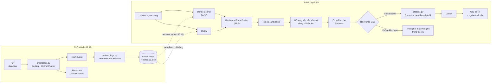

# Hệ thống hỏi–đáp Quy chế Đào tạo HUSC sử dụng RAG

Hệ thống hỗ trợ sinh viên tra cứu **quy chế đào tạo đại học theo hệ thống tín chỉ của Trường Đại học Khoa học, Đại học Huế (HUSC)** bằng kỹ thuật Retrieval-Augmented Generation (RAG).

Khi người dùng đặt câu hỏi, hệ thống tìm các đoạn quy chế liên quan bằng **Dense Search + BM25 + Reciprocal Rank Fusion (RRF)**, rerank bằng **CrossEncoder**, sau đó dùng **Gemini** để sinh câu trả lời dựa trên tài liệu truy xuất được và kèm trích dẫn nguồn.

Dự án hiện ở mức **prototype học thuật**, tập trung vào độ chính xác của truy xuất, khả năng xử lý văn bản sửa đổi và trích dẫn nguồn rõ ràng.

## Dữ liệu hiện tại

Corpus chính gồm 2 tài liệu:

- **Quyết định 673/QĐ-ĐHKH ngày 22/09/2021** — Quy chế đào tạo đại học theo hệ thống tín chỉ của Trường Đại học Khoa học.
- **Quyết định 1453/QĐ-ĐHKH ngày 19/12/2025** — văn bản sửa đổi một phần Quy chế ban hành theo Quyết định 673/QĐ-ĐHKH, có hiệu lực từ **19/01/2026**.

Hệ thống có xử lý quan hệ giữa văn bản gốc và văn bản sửa đổi. Khi câu hỏi liên quan đúng phạm vi đã được sửa, văn bản sửa đổi đang có hiệu lực được đưa vào tập ứng viên và ưu tiên khi sinh câu trả lời hiện hành.

## Chức năng chính

- Đọc PDF bằng **Docling** và giữ thông tin cấu trúc tài liệu.
- Làm sạch văn bản và chia chunk bằng `HybridChunker`.
- Trích metadata cấp văn bản: số quyết định, ngày ban hành, ngày hiệu lực, loại văn bản và quan hệ sửa đổi.
- Xây dựng metadata phân cấp **Chương – Mục – Điều** từ heading của tài liệu.
- Tạo embedding tiếng Việt bằng `bkai-foundation-models/vietnamese-bi-encoder`.
- Lưu vector bằng **FAISS `IndexFlatIP`**.
- Kết hợp **Dense Search + BM25 + RRF**.
- Rerank ứng viên bằng `cross-encoder/mmarco-mMiniLMv2-L12-H384-v1`.
- Có **relevance gate** để từ chối câu hỏi ngoài phạm vi tài liệu.
- Có cơ chế exact-match hỗ trợ các truy vấn ngắn như `tiết 6`, `điểm F`, `thi hộ`.
- Sinh câu trả lời bằng Gemini, chỉ dựa trên context được truy xuất.
- Trích dẫn theo dạng `[Nguồn n]` và hiển thị số văn bản, Điều, trang.
- Giao diện hỏi–đáp bằng **Streamlit**.
- Có script đánh giá retrieval, answer và OOD.

## Kiến trúc hệ thống



## Cấu trúc thư mục

```text
Project-LLM-RAG/
├── data/
│   ├── raw/                       # PDF gốc
│   │   ├── 01_quy_che_dao_tao_husc_qd_673_2021.pdf
│   │   └── qd_1453_dhkh.pdf
│   ├── extracted/                 # Markdown do Docling xuất ra
│   ├── chunks/
│   │   └── chunks.json            # Chunk và metadata
│   └── reports/
│       └── evaluation_report.json # Kết quả đánh giá
│
├── vector_store/
│   ├── faiss_index.bin            # FAISS IndexFlatIP
│   └── metadata.json              # Metadata tương ứng từng vector
│
├── src/
│   ├── app.py                     # Giao diện Streamlit
│   ├── citations.py               # Tạo context và định dạng nguồn
│   ├── embeddings.py              # Tạo embedding và FAISS index
│   ├── evaluate.py                # Đánh giá hệ thống
│   ├── preprocess.py              # PDF -> chunk + metadata
│   ├── rag_pipeline.py            # Retriever + Gemini
│   └── retriever.py               # Dense + BM25 + RRF + CrossEncoder
│
├── .env
├── .gitignore
├── requirements.txt
└── README.md
```

> `query_expansion.py` không còn được sử dụng trong pipeline hiện tại. Thực nghiệm cho thấy retrieval hiện tại đã đủ tốt mà không cần thêm một lượt Gemini để mở rộng truy vấn, giúp giảm đáng kể thời gian phản hồi.

## Công nghệ sử dụng

| Thành phần | Công nghệ |
| --- | --- |
| Ngôn ngữ | Python 3.11 |
| Xử lý PDF | Docling |
| Chia chunk | Docling `HybridChunker` |
| Embedding | `bkai-foundation-models/vietnamese-bi-encoder` |
| Vector Search | FAISS `IndexFlatIP` |
| Sparse Search | BM25Okapi (`rank-bm25`) |
| Fusion | Reciprocal Rank Fusion (RRF) |
| Reranker | `cross-encoder/mmarco-mMiniLMv2-L12-H384-v1` |
| LLM | Google Gemini |
| SDK Gemini | `google-genai` |
| Giao diện | Streamlit |
| Biến môi trường | `python-dotenv` |

## Cài đặt

### 1. Clone repository

```bash
git clone https://github.com/baothenotone/Project-LLM-RAG.git
cd Project-LLM-RAG
```

### 2. Tạo môi trường ảo

Windows PowerShell:

```powershell
python -m venv .venv
.\.venv\Scripts\Activate.ps1
```

Linux/macOS:

```bash
python3 -m venv .venv
source .venv/bin/activate
```

### 3. Cài thư viện

```bash
python -m pip install --upgrade pip
pip install -r requirements.txt
```

## Cấu hình `.env`

Tạo file `.env` tại thư mục gốc:

```env
GEMINI_API_KEY=your_gemini_api_key
GEMINI_MODEL=gemini-3.1-flash-lite
HF_TOKEN=your_huggingface_token
```

Trong đó:

- `GEMINI_API_KEY`: API key dùng để gọi Gemini.
- `GEMINI_MODEL`: model Gemini dùng để sinh câu trả lời.
- `HF_TOKEN`: token Hugging Face, giúp tải model ổn định hơn và tránh giới hạn request không xác thực.

File `.env` phải nằm trong `.gitignore` và không nên được đưa lên GitHub hoặc đóng gói chia sẻ công khai.

## Cách chạy

### Chạy giao diện hỏi–đáp

Nếu `vector_store/` đã được tạo sẵn:

```bash
streamlit run src/app.py
```

Sau khi khởi động, mở địa chỉ Streamlit hiển thị trên terminal, thường là:

```text
http://localhost:8501
```

## Xây dựng lại dữ liệu

Nếu thay đổi hoặc thêm PDF trong `data/raw/`, chạy lại theo thứ tự sau.

### Bước 1 — Tiền xử lý PDF

```bash
python src/preprocess.py
```

Kết quả:

```text
data/extracted/*.md
data/chunks/chunks.json
```

`preprocess.py` thực hiện:

1. Đọc PDF bằng Docling.
2. Export Markdown để giữ cấu trúc và kiểm tra dữ liệu.
3. Làm sạch Unicode và ký tự rác.
4. Chia văn bản bằng `HybridChunker`, giới hạn khoảng 256 token.
5. Lọc header/footer, số trang, chunk quá ngắn và chunk trùng.
6. Trích metadata chung của văn bản.
7. Xây dựng quan hệ Chương – Mục – Điều.
8. Ghi nhận quan hệ văn bản sửa đổi.

Các trường metadata quan trọng gồm:

```text
document_number
document_title
issued_date
effective_date
document_type
chapter
section
article
amends_document
amends_article
amends_clause
amends_point
pages
```

`clause` và `point` của chunk không được cố suy đoán nếu cấu trúc PDF không đủ tin cậy. Điều này giúp tránh metadata sai do lỗi layout của PDF.

### Bước 2 — Tạo embedding và FAISS index

```bash
python src/embeddings.py
```

Kết quả:

```text
vector_store/faiss_index.bin
vector_store/metadata.json
```

`embeddings.py` đọc `embedding_text` của từng chunk, tạo vector bằng Vietnamese Bi-Encoder, normalize vector và lưu vào FAISS.

### Bước 3 — Chạy lại ứng dụng

```bash
streamlit run src/app.py
```

## Cơ chế retrieval

`retriever.py` sử dụng pipeline sau:

### 1. Dense Search

Câu hỏi được encode bằng cùng model embedding với corpus và tìm kiếm trên FAISS.

```text
Câu hỏi -> Bi-Encoder -> query vector -> FAISS
```

Mặc định lấy tối đa `30` kết quả Dense ban đầu.

### 2. BM25

Câu hỏi cũng được token hóa và tìm theo từ khóa trên toàn bộ chunk bằng BM25.

BM25 hữu ích với các cụm chính xác như:

```text
Điều 20
Tiết 6
điểm F
thi hộ
```

### 3. Reciprocal Rank Fusion

Hai bảng xếp hạng Dense và BM25 được hợp nhất bằng RRF:

```text
Dense ranking + BM25 ranking -> RRF
```

Sau RRF, hệ thống giữ khoảng `20` candidate tốt nhất để rerank.

### 4. Xử lý văn bản sửa đổi

Nếu candidate chứa Điều thuộc văn bản gốc và hệ thống phát hiện một văn bản sửa đổi đang có hiệu lực đối với Điều đó, các chunk của văn bản sửa đổi được bổ sung vào candidate pool.

Ví dụ:

```text
673/QĐ-ĐHKH - Điều 2
        ↓
1453/QĐ-ĐHKH sửa Điểm a, Khoản 1, Điều 2
        ↓
đưa QĐ 1453 vào candidate pool
```

Cơ chế này tránh trả lại quy định cũ khi nội dung đã được sửa đổi.

### 5. CrossEncoder Reranking

CrossEncoder chấm lại từng cặp:

```text
(câu hỏi gốc, candidate chunk)
```

Khác với phiên bản trước, reranker chỉ sử dụng **câu hỏi gốc**, giúp giảm query drift và giảm mạnh số lượng cặp cần tính điểm.

### 6. Relevance Gate

Hệ thống dùng điểm CrossEncoder để xác định câu hỏi có thực sự liên quan đến corpus hay không.

Ngưỡng hiện tại:

```python
RELEVANCE_THRESHOLD = -2
```

Nếu điểm tốt nhất thấp hơn ngưỡng và không có exact-match đáng tin cậy, retriever trả về danh sách rỗng.

Nhờ đó các câu như:

```text
Messi ghi bao nhiêu bàn thắng?
Trường có bán đồ ăn trưa không?
```

được chặn trước khi gọi Gemini.

### 7. Exact-match cho truy vấn ngắn

Các truy vấn ngắn có thể bị CrossEncoder chấm thấp dù đúng miền dữ liệu, ví dụ:

```text
tiết 6
điểm F
thi hộ
```

Vì vậy hệ thống kiểm tra thêm exact-match trên candidate pool để tránh loại nhầm các truy vấn hợp lệ này.

## Sinh câu trả lời và trích dẫn

`rag_pipeline.py` nhận top-k chunk từ retriever và dùng `citations.py` tạo context dạng:

```text
[Nguồn 1]
Số văn bản: 673/QĐ-ĐHKH
Ngày hiệu lực: 2021-09-22
Điều: Điều 6
Trang: 6, 7
Nội dung:
...
```

Nếu là văn bản sửa đổi, context có thêm:

```text
Loại: Văn bản sửa đổi
Sửa văn bản: 673/QĐ-ĐHKH
Phạm vi sửa đổi: Điểm a, Khoản 1, Điều 2
```

Gemini được yêu cầu:

- chỉ trả lời dựa trên context;
- không bổ sung thông tin ngoài tài liệu;
- ưu tiên văn bản sửa đổi đang có hiệu lực khi đúng phạm vi;
- không xem văn bản sửa đổi là thay thế toàn bộ văn bản gốc;
- trích `[Nguồn n]` ngay sau thông tin được sử dụng.

Trên giao diện, hệ thống chỉ hiển thị **những nguồn thực sự được Gemini trích dẫn**, thay vì hiển thị toàn bộ top-k retrieval.

Ví dụ:

```text
1. 673/QĐ-ĐHKH - Điều 6 - Trang 6, 7
```

hoặc với văn bản sửa đổi:

```text
2. 1453/QĐ-ĐHKH - Điều 1 - Sửa: Điểm a, Khoản 1, Điều 2 - Trang 2
```

## Đánh giá hệ thống

Chạy:

```bash
python src/evaluate.py
```

Báo cáo được lưu tại:

```text
data/reports/evaluation_report.json
```

Các metric hiện được sử dụng:

- **Retrieval Hit@3**: nguồn đúng có xuất hiện trong top 3 hay không.
- **MRR**: đánh giá thứ hạng của nguồn đúng.
- **Answer Accuracy**: kiểm tra câu trả lời có chứa các ý chính mong đợi.
- **OOD Accuracy**: kiểm tra hệ thống có từ chối đúng câu hỏi ngoài phạm vi hay không.
- **Average Time**: thời gian phản hồi trung bình.

Kết quả của lần đánh giá gần nhất trên **8 câu hỏi kiểm thử hiện tại**:

| Metric | Kết quả |
| --- | ---: |
| Retrieval Hit@3 | 1.0000 |
| MRR | 0.9167 |
| Answer Accuracy | 1.0000 |
| OOD Accuracy | 1.0000 |
| Thời gian trung bình | 2.31 giây |

> Các con số trên chỉ phản ánh bộ test hiện tại và không nên được hiểu là hệ thống đạt độ chính xác 100% trên mọi câu hỏi thực tế.

## Một số câu hỏi thử nghiệm

```text
Tín chỉ là gì?
Sinh viên bị buộc thôi học trong những trường hợp nào?
Sinh viên thi hộ lần đầu bị xử lý như thế nào?
Thi tự luận học phần 3 tín chỉ kéo dài bao lâu?
Một ngày có bao nhiêu tiết học?
Tiết 13 học từ mấy giờ đến mấy giờ?
tiết 6
```

Câu ngoài phạm vi:

```text
Messi ghi bao nhiêu bàn thắng?
Trường có bán đồ ăn trưa cho sinh viên không?
```

## Luồng chạy tổng quát

```text
PDF
 ↓
Docling
 ↓
HybridChunker + metadata pháp lý
 ↓
chunks.json
 ↓
Vietnamese Bi-Encoder
 ↓
FAISS

Câu hỏi
 ↓
Dense Search + BM25
 ↓
RRF
 ↓
Bổ sung văn bản sửa đổi nếu cần
 ↓
CrossEncoder
 ↓
Relevance Gate
 ↓
Top-k context
 ↓
Gemini
 ↓
Câu trả lời + trích dẫn nguồn
```

## Giới hạn hiện tại

- Corpus hiện chỉ gồm các tài liệu quy chế đang được đưa vào `data/raw/`.
- Metadata Khoản/Điểm của văn bản gốc chưa được suy đoán tự động nếu PDF không đủ ổn định.
- Relevance threshold hiện được hiệu chỉnh trên bộ test nhỏ và cần đánh giá thêm nếu corpus mở rộng.
- Bộ evaluation hiện tại còn ít câu hỏi, cần mở rộng trước khi đưa ra kết luận tổng quát về độ chính xác.
- Đây là hệ thống hỗ trợ tra cứu; khi cần sử dụng cho quyết định học vụ quan trọng, người dùng vẫn nên kiểm tra văn bản gốc và thông báo chính thức của Nhà trường.

## Bảo mật

Không commit các file chứa secret:

```text
.env
```

`.gitignore` nên có tối thiểu:

```gitignore
.env
__pycache__/
*.pyc
.venv/
```

Khi chia sẻ hoặc đóng gói project, nên kiểm tra lại để tránh đưa `GEMINI_API_KEY` hoặc `HF_TOKEN` vào ZIP/Git.
