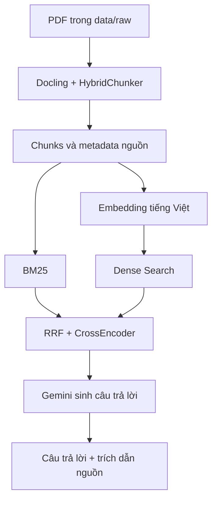

# Hệ thống hỏi–đáp quy chế đào tạo tiếng Việt sử dụng RAG

Đây là hệ thống hỏi–đáp hỗ trợ tra cứu **quy chế đào tạo bằng tiếng Việt**. Hệ thống tìm các đoạn tài liệu liên quan đến câu hỏi, dùng Gemini để tạo câu trả lời ngắn gọn và hiển thị nguồn tham khảo theo tên tài liệu, số trang.

Dự án được xây dựng ở mức **prototype** cho đề tài:

> Xây dựng hệ thống hỏi–đáp hỗ trợ tra cứu quy chế đào tạo tiếng Việt sử dụng RAG có trích dẫn nguồn.

## Chức năng chính

- Đọc và phân tích tài liệu PDF bằng Docling.
- Làm sạch văn bản, chia chunk và giữ metadata pháp lý như chương, mục, điều, khoản, điểm.
- Tạo embedding bằng mô hình tiếng Việt `bkai-foundation-models/vietnamese-bi-encoder`.
- Kết hợp Dense Search và BM25 bằng Reciprocal Rank Fusion (RRF).
- Mở rộng truy vấn bằng Gemini để tăng khả năng tìm đúng khi người dùng diễn đạt khác tài liệu.
- Sắp xếp lại kết quả bằng CrossEncoder.
- Sinh câu trả lời chỉ dựa trên nội dung truy xuất được.
- Trích dẫn theo dạng `[Nguồn n]`, kèm tên file và số trang.
- Hỗ trợ giao diện Streamlit và chế độ hỏi–đáp trên terminal.

## Kiến trúc hệ thống



Luồng xử lý gồm hai giai đoạn:

1. **Chuẩn bị dữ liệu:** PDF → trích xuất → làm sạch → chia chunk → tạo embedding → lưu vector và metadata.
2. **Hỏi–đáp:** câu hỏi → mở rộng truy vấn → truy xuất lai → rerank → tạo context có nguồn → Gemini sinh câu trả lời.

## Công nghệ sử dụng

| Thành phần | Công nghệ |
| --- | --- |
| Ngôn ngữ | Python |
| Đọc và phân tích PDF | Docling, PyMuPDF |
| Chia chunk | Docling `HybridChunker` |
| Embedding | `bkai-foundation-models/vietnamese-bi-encoder` |
| Tìm kiếm ngữ nghĩa | NumPy, cosine similarity |
| Tìm kiếm từ khóa | BM25 (`rank-bm25`) |
| Hợp nhất kết quả | Reciprocal Rank Fusion |
| Reranker | `cross-encoder/mmarco-mMiniLMv2-L12-H384-v1` |
| Mô hình sinh câu trả lời | Google Gemini API |
| Giao diện | Streamlit |

> Lưu ý: phiên bản hiện tại lưu vector trực tiếp trong `embeddings.npy` và tìm kiếm bằng NumPy; chưa sử dụng FAISS trong luồng chạy chính.

## Cấu trúc thư mục

```text
Project-LLM-RAG/
├── data/
│   ├── raw/                    # Tài liệu PDF đầu vào
│   ├── extracted/              # Văn bản Markdown do Docling trích xuất
│   ├── chunks/
│   │   ├── chunks.json         # Các chunk dùng để tạo embedding
│   │   └── rejected_chunks.json
│   └── reports/
│       ├── chunks_preview.txt  # Bản xem nhanh các chunk
│       └── preprocess_report.json
├── vector_store/
│   ├── embeddings.npy         # Ma trận vector embedding
│   ├── metadata.json          # Metadata tương ứng với từng vector
│   ├── embeddings_preview.csv
│   └── show_embedding.py
├── src/
│   ├── preprocess.py          # Trích xuất, làm sạch và chia chunk
│   ├── embeddings.py          # Tạo embedding và metadata
│   ├── query_expansion.py     # Mở rộng câu hỏi bằng Gemini
│   ├── retriever.py           # Dense Search + BM25 + RRF + reranker
│   ├── citations.py           # Chuẩn hóa và định dạng nguồn
│   ├── rag_pipeline.py        # Truy xuất và sinh câu trả lời
│   ├── app.py                 # Giao diện Streamlit
│   └── ingest.py              # Bộ đọc PDF PyMuPDF phiên bản cơ bản
├── requirements.txt
└── README.md
```

`src/preprocess.py` là luồng tiền xử lý chính hiện tại. `src/ingest.py` là phiên bản đọc PDF cơ bản bằng PyMuPDF và không bắt buộc trong luồng Docling.

## Yêu cầu môi trường

- Python 3.11 được khuyến nghị.
- Git.
- Kết nối Internet trong lần đầu để tải các mô hình từ Hugging Face.
- Gemini API key.

## Cài đặt

### 1. Tải dự án

```bash
git clone --branch bao-dev https://github.com/baothenotone/Project-LLM-RAG.git
cd Project-LLM-RAG
```

### 2. Tạo môi trường ảo

Trên Windows PowerShell:

```powershell
python -m venv .venv
.\.venv\Scripts\Activate.ps1
```

Trên Linux hoặc macOS:

```bash
python3 -m venv .venv
source .venv/bin/activate
```

### 3. Cài thư viện

```bash
python -m pip install --upgrade pip
python -m pip install -r requirements.txt
python -m pip install docling transformers google-genai
```

Ba gói ở lệnh cuối được mã nguồn hiện tại sử dụng trực tiếp nhưng chưa được khai báo trong `requirements.txt` của nhánh `bao-dev`.

## Cấu hình biến môi trường

Tạo file `.env` tại thư mục gốc của dự án:

```env
GEMINI_API_KEY=your_gemini_api_key
GEMINI_MODEL=your_available_gemini_model

ENABLE_QUERY_EXPANSION=true
ENABLE_RERANKER=true
RERANKER_MODEL=cross-encoder/mmarco-mMiniLMv2-L12-H384-v1

# Không bắt buộc, dùng để tăng giới hạn tải mô hình từ Hugging Face
HF_TOKEN=your_hugging_face_token
```

Trong đó:

- `GEMINI_API_KEY`: khóa truy cập Gemini API.
- `GEMINI_MODEL`: tên model Gemini hiện có trong tài khoản của bạn.
- `ENABLE_QUERY_EXPANSION`: bật hoặc tắt mở rộng truy vấn.
- `ENABLE_RERANKER`: bật hoặc tắt CrossEncoder reranker.
- `RERANKER_MODEL`: tên mô hình reranker.
- `HF_TOKEN`: không bắt buộc; giúp hạn chế cảnh báo và tăng giới hạn tải từ Hugging Face.

File `.env` đã được khai báo trong `.gitignore`, vì vậy API key không được đưa lên GitHub.

## Chạy nhanh với dữ liệu có sẵn

Nhánh `bao-dev` đã chứa `chunks.json`, `embeddings.npy` và `metadata.json`. Sau khi cài thư viện và tạo `.env`, có thể chạy trực tiếp.

### Chế độ terminal

```bash
python src/rag_pipeline.py
```

Nhập câu hỏi tiếng Việt. Nhập `exit` hoặc `quit` để kết thúc.

### Giao diện Streamlit

```bash
python -m streamlit run src/app.py
```

Sau khi khởi động, mở địa chỉ Streamlit hiển thị trên terminal, thông thường là `http://localhost:8501`.

## Xây dựng lại dữ liệu từ PDF

Đặt các tài liệu PDF vào:

```text
data/raw/
```

Sau đó chạy lần lượt:

### Bước 1: Tiền xử lý và chia chunk

```bash
python src/preprocess.py
```

Kết quả chính:

- `data/extracted/*.md`
- `data/chunks/chunks.json`
- `data/reports/chunks_preview.txt`
- `data/reports/preprocess_report.json`

### Bước 2: Tạo embedding

```bash
python src/embeddings.py
```

Kết quả chính:

- `vector_store/embeddings.npy`
- `vector_store/metadata.json`

### Bước 3: Chạy hỏi–đáp

```bash
python src/rag_pipeline.py
```

hoặc:

```bash
python -m streamlit run src/app.py
```

> Nếu thay đổi mô hình embedding, phải chạy lại cả `preprocess.py` và `embeddings.py` để tokenizer, số chiều vector và metadata đồng bộ.

## Cách hệ thống truy xuất tài liệu

Với mỗi câu hỏi, `HybridRetriever` thực hiện:

1. Chuẩn hóa và tạo các biến thể truy vấn.
2. Tạo embedding cho truy vấn.
3. Tính điểm Dense Search với toàn bộ vector tài liệu.
4. Tính điểm BM25 trên nội dung và tiêu đề chunk.
5. Kết hợp hai bảng xếp hạng bằng RRF.
6. Dùng CrossEncoder đánh giá lại các ứng viên.
7. Trả về các chunk tốt nhất cùng metadata nguồn.

`RAGPipeline` đánh số các chunk thành `[Nguồn 1]`, `[Nguồn 2]`, ... rồi yêu cầu Gemini chỉ trả lời dựa trên phần tài liệu tham khảo. Khi không có kết quả phù hợp, hệ thống trả về thông báo không tìm thấy thông tin trong tài liệu.

## Dữ liệu hiện có trên nhánh `bao-dev`

- 1 tài liệu quy chế đào tạo PDF.
- 140 chunk.
- 140 vector embedding, mỗi vector có 768 chiều.
- Metadata gồm tên file, trang, tiêu đề tài liệu, chương, mục, điều, khoản, điểm và nội dung chunk.

Các số liệu có thể thay đổi sau khi thêm tài liệu hoặc chạy lại bước tiền xử lý.

## Một số câu hỏi thử nghiệm

- Tín chỉ là gì?
- Sinh viên bị cảnh báo học tập trong trường hợp nào?
- Sinh viên có được học cải thiện điểm không?
- Điều kiện xét tốt nghiệp là gì?
- Sinh viên được bảo lưu kết quả học tập trong trường hợp nào?

## Lưu ý

- Lần chạy đầu tiên có thể chậm vì hệ thống phải tải embedding model và reranker.
- Không commit file `.env` hoặc API key lên GitHub.
- Chất lượng câu trả lời phụ thuộc vào text layer của PDF, cách chia chunk và dữ liệu đầu vào.
- Hệ thống chỉ nên trả lời dựa trên nguồn đã truy xuất; cần kiểm tra lại tên tài liệu và số trang với các câu hỏi quan trọng.
- Các notebook hiện chủ yếu đóng vai trò khung thử nghiệm theo từng giai đoạn.

## Nhóm thực hiện

- Nguyễn Cửu Quốc Bảo
- Nguyễn Đình Thi

## Phạm vi dự án

Đây là prototype phục vụ học tập và thử nghiệm RAG trên tài liệu quy chế đào tạo tiếng Việt, chưa phải hệ thống tư vấn học vụ chính thức.
