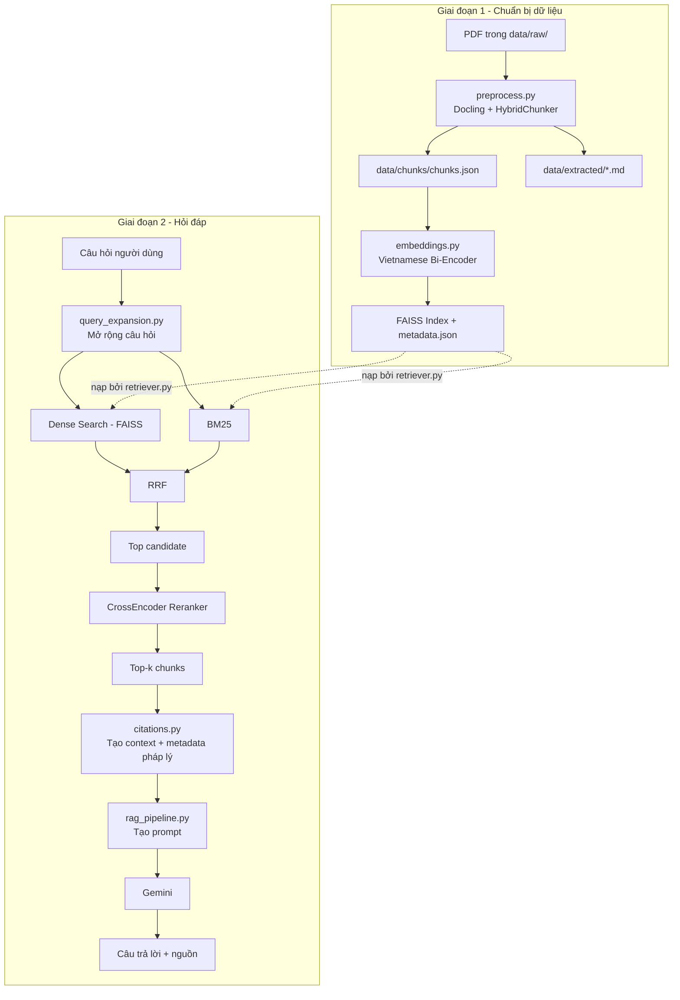

# Hệ thống hỏi–đáp Quy chế Đào tạo HUSC sử dụng RAG

Hệ thống hỗ trợ sinh viên tra cứu **quy chế đào tạo đại học của Trường Đại học Khoa học, Đại học Huế (HUSC)** bằng kỹ thuật **Retrieval-Augmented Generation (RAG)**.

Người dùng có thể đặt câu hỏi bằng tiếng Việt tự nhiên. Hệ thống sẽ tìm các đoạn quy chế liên quan, rerank kết quả, đưa tài liệu phù hợp cho Gemini và sinh câu trả lời kèm trích dẫn nguồn.

Dự án được xây dựng ở mức **prototype phục vụ đề tài học phần**, tập trung vào khả năng tra cứu đúng nội dung quy chế, xử lý cách hỏi đa dạng và hiển thị nguồn tham khảo rõ ràng.

## Dữ liệu hiện tại

Corpus chính gồm các văn bản của Trường Đại học Khoa học:

- **Quyết định 673/QĐ-ĐHKH ngày 22/09/2021** — Quy chế đào tạo đại học theo hệ thống tín chỉ.
- **Quyết định 1453/QĐ-ĐHKH ngày 19/12/2025** — Văn bản sửa đổi một phần Quy chế ban hành theo Quyết định 673/QĐ-ĐHKH.

Hệ thống lưu metadata như số văn bản, ngày ban hành, ngày hiệu lực, Chương/Điều khi xác định được và thông tin phạm vi sửa đổi của văn bản mới.

> Với Khoản/Điểm của văn bản gốc, hệ thống không cố suy đoán bằng regex khi cấu trúc PDF không đủ ổn định, nhằm tránh tạo metadata sai.

---

## Chức năng chính

- Đọc PDF và phân tích cấu trúc bằng **Docling**.
- Xuất Markdown để kiểm tra nội dung sau khi trích xuất.
- Làm sạch văn bản và chia chunk bằng `HybridChunker`.
- Tạo embedding tiếng Việt bằng `bkai-foundation-models/vietnamese-bi-encoder`.
- Lưu vector bằng **FAISS**.
- Mở rộng câu hỏi bằng **Gemini Query Expansion** để tăng khả năng tìm đúng khi cách hỏi khác với cách viết trong quy chế.
- Kết hợp **Dense Search + BM25**.
- Hợp nhất thứ hạng bằng **Reciprocal Rank Fusion (RRF)**.
- Rerank bằng **CrossEncoder**.
- Sinh câu trả lời bằng Gemini chỉ dựa trên context được truy xuất.
- Trích dẫn theo dạng `[Nguồn n]`.
- Hiển thị nguồn theo **số văn bản - Điều - Trang**.
- Giao diện chat bằng **Streamlit**.
- Có script đánh giá retrieval, câu trả lời và thời gian phản hồi.

---

## Kiến trúc hệ thống



### Luồng hỏi–đáp

```text
Câu hỏi
   ↓
Query Expansion
   ↓
Câu hỏi gốc + các biến thể
   ↓
Dense Search + BM25
   ↓
RRF
   ↓
Top candidate
   ↓
CrossEncoder rerank
   ↓
Top 5 chunk
   ↓
Gemini + context
   ↓
Câu trả lời + [Nguồn n]
```

Retriever hiện ưu tiên **độ bao phủ thông tin**. Các query mở rộng được sử dụng cho cả Dense Search, BM25 và CrossEncoder reranking nhằm hạn chế bỏ sót tài liệu khi người dùng diễn đạt khác với văn bản gốc.

---

## Cấu trúc thư mục

```text
Project-LLM-RAG/
├── data/
│   ├── raw/
│   │   ├── 01_quy_che_dao_tao_husc_qd_673_2021.pdf
│   │   └── qd_1453_dhkh.pdf
│   ├── extracted/
│   │   └── *.md
│   ├── chunks/
│   │   └── chunks.json
│   └── reports/
│       └── evaluation_report.json
│
├── vector_store/
│   ├── faiss_index.bin
│   └── metadata.json
│
├── src/
│   ├── app.py
│   ├── citations.py
│   ├── embeddings.py
│   ├── evaluate.py
│   ├── preprocess.py
│   ├── query_expansion.py
│   ├── rag_pipeline.py
│   └── retriever.py
│
├── .env
├── .gitignore
├── requirements.txt
└── README.md
```

### Vai trò từng file

| File | Chức năng |
| --- | --- |
| `preprocess.py` | Đọc PDF, làm sạch, chia chunk và tạo metadata |
| `embeddings.py` | Tạo embedding và xây dựng FAISS index |
| `query_expansion.py` | Dùng Gemini tạo thêm các truy vấn tương đương |
| `retriever.py` | Dense Search + BM25 + RRF + CrossEncoder |
| `citations.py` | Tạo context và định dạng nguồn trích dẫn |
| `rag_pipeline.py` | Kết nối retriever với Gemini để sinh câu trả lời |
| `app.py` | Giao diện hỏi–đáp Streamlit |
| `evaluate.py` | Đánh giá hệ thống trên bộ câu hỏi kiểm thử |

---

## Công nghệ sử dụng

| Thành phần | Công nghệ |
| --- | --- |
| Ngôn ngữ | Python |
| PDF Processing | Docling |
| Chunking | Docling `HybridChunker` |
| Embedding | `bkai-foundation-models/vietnamese-bi-encoder` |
| Vector Search | FAISS |
| Keyword Search | BM25Okapi |
| Fusion | Reciprocal Rank Fusion |
| Reranker | `cross-encoder/mmarco-mMiniLMv2-L12-H384-v1` |
| Query Expansion | Google Gemini |
| Generation | Google Gemini |
| UI | Streamlit |
| Environment | python-dotenv |

---

## Cài đặt

### 1. Clone project

```bash
git clone https://github.com/baothenotone/Project-LLM-RAG.git
cd Project-LLM-RAG
```

### 2. Tạo môi trường ảo

Windows PowerShell:

```powershell
python -m venv .venv
.\.venv\Scripts\Activate.ps1
```

Linux/macOS:

```bash
python3 -m venv .venv
source .venv/bin/activate
```

### 3. Cài thư viện

```bash
python -m pip install --upgrade pip
python -m pip install -r requirements.txt
```

Nếu `requirements.txt` hiện tại chưa khai báo đầy đủ các package mới sử dụng trong source, cài thêm:

```bash
python -m pip install docling google-genai transformers
```

---

## Cấu hình `.env`

Tạo file `.env` tại thư mục gốc:

```env
GEMINI_API_KEY=your_gemini_api_key
GEMINI_MODEL=gemini-3.1-flash-lite
HF_TOKEN=your_huggingface_token
```

Trong đó:

- `GEMINI_API_KEY`: API key để gọi Gemini.
- `GEMINI_MODEL`: model dùng cho Query Expansion và sinh câu trả lời.
- `HF_TOKEN`: token Hugging Face, giúp tải model ổn định hơn và tránh giới hạn request không xác thực.

Các tùy chọn như Query Expansion và CrossEncoder hiện đã có giá trị mặc định trong code, nên không bắt buộc phải thêm vào `.env`.

> Không commit file `.env` lên Git.

---

## Cách chạy

Nếu project đã có sẵn `chunks.json`, FAISS index và metadata thì có thể chạy trực tiếp giao diện.

### Chạy giao diện Streamlit

```bash
python -m streamlit run src/app.py
```

Sau khi khởi động, truy cập địa chỉ Streamlit hiển thị trên terminal, thường là:

```text
http://localhost:8501
```

---

## Xây dựng lại dữ liệu

Khi thay đổi PDF hoặc muốn build lại toàn bộ corpus, chạy theo thứ tự sau.

### Bước 1: Tiền xử lý PDF

```bash
python src/preprocess.py
```

Kết quả:

```text
data/extracted/*.md
data/chunks/chunks.json
```

`preprocess.py` thực hiện:

1. Đọc PDF bằng Docling.
2. Xuất Markdown để kiểm tra nội dung.
3. Làm sạch Unicode và ký tự rác.
4. Chia chunk bằng `HybridChunker`.
5. Loại chunk quá ngắn, header/footer và nội dung trùng.
6. Gắn số trang và heading.
7. Trích metadata cấp văn bản.
8. Xác định Chương/Điều khi có đủ thông tin.
9. Ghi nhận quan hệ sửa đổi của Quyết định 1453 đối với Quyết định 673.

### Bước 2: Tạo embedding và FAISS index

```bash
python src/embeddings.py
```

Kết quả:

```text
vector_store/faiss_index.bin
vector_store/metadata.json
```

### Bước 3: Chạy ứng dụng

```bash
python -m streamlit run src/app.py
```

---

## Cơ chế truy xuất

`retriever.py` sử dụng Hybrid Retrieval gồm hai hướng tìm kiếm.

### 1. Query Expansion

Câu hỏi được gửi tới Gemini để sinh thêm các cách diễn đạt tương đương.

Ví dụ:

```text
Tín chỉ là gì?
↓
Định nghĩa tín chỉ
Khái niệm tín chỉ
...
```

Câu hỏi gốc luôn được giữ lại.

### 2. Dense Search

Các query được encode bằng:

```text
bkai-foundation-models/vietnamese-bi-encoder
```

sau đó tìm kiếm trên FAISS.

### 3. BM25

BM25 tìm các chunk có từ khóa phù hợp với từng query variant.

Điều này giúp bổ sung cho Dense Search khi câu hỏi chứa thuật ngữ, số Điều, số tiết, điểm số hoặc cụm từ xuất hiện trực tiếp trong quy chế.

### 4. Reciprocal Rank Fusion

Kết quả Dense Search và BM25 được hợp nhất bằng RRF:

```text
score = 1 / (rrf_k + rank)
```

Retriever mặc định sử dụng:

```text
pool_size = 50
rrf_k = 60
```

và lấy tối đa 60 candidate sau bước fusion.

### 5. CrossEncoder Reranking

CrossEncoder chấm lại các candidate với toàn bộ query variants.

Với mỗi chunk, hệ thống lấy **điểm rerank cao nhất** trong các cách diễn đạt câu hỏi, sau đó chọn Top 5 chunk làm context cho Gemini.

Cách làm này tốn nhiều thời gian hơn một pipeline tối giản nhưng giúp tăng khả năng tìm đúng tài liệu đối với các câu hỏi ngắn, tự nhiên hoặc diễn đạt khác với văn bản gốc.

---

## Sinh câu trả lời

`rag_pipeline.py` nhận các chunk từ retriever và tạo context theo dạng:

```text
[Nguồn 1]
Số văn bản: ...
Ngày hiệu lực: ...
Điều: ...
Trang: ...
Nội dung: ...
```

Gemini được yêu cầu:

- chỉ sử dụng thông tin trong context;
- không tự bổ sung thông tin ngoài tài liệu;
- ưu tiên quy định sửa đổi khi nguồn cho thấy văn bản mới sửa đúng nội dung đang hỏi;
- trích dẫn `[Nguồn n]` ngay sau thông tin được sử dụng;
- thông báo khi tài liệu không đủ thông tin để trả lời.

---

## Trích dẫn nguồn

Câu trả lời có dạng:

```text
Tín chỉ là đơn vị quy chuẩn dùng để lượng hóa khối lượng học tập của sinh viên [Nguồn 1].
```

Phần nguồn trên giao diện hiển thị theo dạng:

```text
1. 673/QĐ-ĐHKH - Điều 6 - Trang 6, 7
```

Với văn bản sửa đổi, hệ thống có thể hiển thị thêm phạm vi sửa đổi, ví dụ:

```text
1453/QĐ-ĐHKH - Sửa: Điểm a, Khoản 1, Điều 2 - Trang 2
```

Giao diện chỉ hiển thị các nguồn thực sự được Gemini trích dẫn trong câu trả lời, thay vì hiển thị toàn bộ Top 5 retrieval.

---

## Đánh giá hệ thống

Chạy:

```bash
python src/evaluate.py
```

Báo cáo được lưu tại:

```text
data/reports/evaluation_report.json
```

Bộ đánh giá nên bao gồm nhiều nhóm câu hỏi:

- câu hỏi định nghĩa;
- câu hỏi về điều kiện/quy định;
- câu hỏi có số liệu cụ thể;
- câu hỏi về nội dung đã được Quyết định 1453 sửa đổi;
- câu hỏi ngắn như `tiết 6`, `điểm F`, `xếp loại xuất sắc`;
- câu hỏi diễn đạt tự nhiên khác với văn bản;
- câu hỏi ngoài phạm vi tài liệu.

Không nên đánh giá hệ thống chỉ bằng việc "có lấy được source hay không". Khi xây dựng bộ test cuối, nên kiểm tra riêng chất lượng retrieval và tính đúng của câu trả lời.

---

## Một số câu hỏi thử nghiệm

```text
Tín chỉ là gì?

Sinh viên bị buộc thôi học trong những trường hợp nào?

Sinh viên thi hộ bị xử lý như thế nào?

Xếp loại xuất sắc được quy định như thế nào?

Điểm F là gì?

Tiết 6 học vào mấy giờ?

Một ngày có bao nhiêu tiết học?

Tiết 13 học từ mấy giờ đến mấy giờ?

Điều kiện xét tốt nghiệp là gì?
```

---

## Lưu ý

- Khi thay đổi PDF, cần chạy lại `preprocess.py` và `embeddings.py`.
- Khi thay đổi mô hình embedding, phải build lại vector store.
- Query Expansion và CrossEncoder giúp tăng recall/ranking nhưng cũng làm thời gian phản hồi tăng.
- Không nên giảm candidate hoặc thêm threshold lọc mạnh nếu chưa đánh giá trên tập câu hỏi đủ đa dạng, vì có thể làm mất các câu hỏi hợp lệ.
- Các quy định học vụ có thể thay đổi theo văn bản mới; corpus cần được cập nhật khi trường ban hành quyết định mới.
- Đây là hệ thống hỗ trợ tra cứu. Khi cần xác nhận chính thức, người dùng nên đối chiếu với văn bản gốc của nhà trường.

---

## Tác giả

Đề tài xây dựng hệ thống hỏi–đáp quy chế đào tạo HUSC sử dụng Retrieval-Augmented Generation (RAG).
